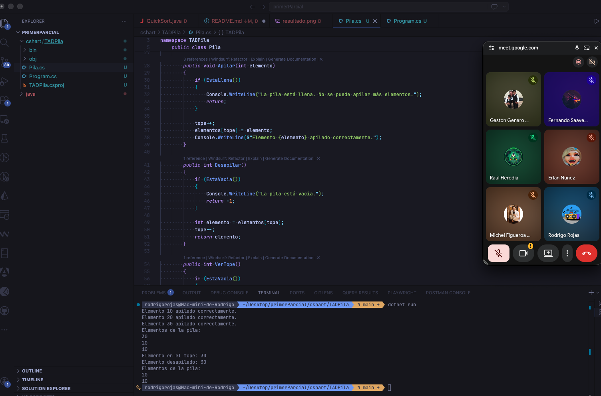

# 📚 Implementación de una TAD Pila en C# .NET

## 🧾 Asignatura
Estructura de Datos I

## 👨‍🎓 Autor
Estudiante de Ingeniería de Sistemas

---

## 📌 1. OBJETIVO

Implementar una **TAD (Tipo Abstracto de Dato)** de tipo **Pila** en C# utilizando .NET, aplicando los conceptos fundamentales de estructuras de datos y programación orientada a objetos.

---

## 📖 2. ANTECEDENTES

Las **TAD (Tipos Abstractos de Datos)** permiten modelar estructuras de datos definiendo:

- Su comportamiento  
- Sus operaciones  
- Su forma de uso  

sin enfocarse inicialmente en la implementación interna.

Una de las estructuras más importantes es la **Pila**, la cual trabaja bajo el principio:

> **LIFO (Last In, First Out)**  
> El último elemento en entrar es el primero en salir.

---

## ⚙️ 3. DESCRIPCIÓN

Se desarrolló una clase llamada `Pila` que implementa las operaciones fundamentales de esta estructura.

### 🔹 Operaciones implementadas

- `Apilar()` → Inserta un elemento  
- `Desapilar()` → Elimina el último elemento  
- `VerTope()` → Muestra el elemento superior  
- `EstaVacia()` → Verifica si la pila está vacía  
- `EstaLlena()` → Verifica si la pila está llena  
- `Mostrar()` → Imprime los elementos  

---

## 🧠 4. ESTRUCTURA DEL PROYECTO

```
TADPila/
│── Program.cs
│── Pila.cs
│── README.md
│── TADPila.csproj
```

---

## ▶️ 5. EJECUCIÓN DEL PROYECTO

### 📌 Requisitos
- Tener instalado .NET SDK

### 🔧 Pasos para ejecutar

```bash
dotnet run
```

---

## 📊 6. EJEMPLO DE EJECUCIÓN

### Entrada:
```
Apilar: 10, 20, 30
```

### Salida:
```
Elemento 10 apilado correctamente.
Elemento 20 apilado correctamente.
Elemento 30 apilado correctamente.

Elementos de la pila:
30
20
10

Elemento en el tope: 30
Elemento desapilado: 30

Elementos de la pila:
20
10
```

---

## 📸 7. EVIDENCIA DE EJECUCIÓN

Agrega aquí tu captura:

```markdown

```

---

## 🧮 8. ANÁLISIS

La implementación de la TAD Pila permite comprender:

- El manejo de estructuras LIFO  
- El uso de arreglos para almacenamiento  
- El control mediante índices (variable `tope`)  
- La aplicación de validaciones (pila llena/vacía)  

---

## ✅ 9. CONCLUSIONES

- Se logró implementar correctamente una TAD Pila en C# .NET.  
- Se aplicaron conceptos fundamentales de estructuras de datos.  
- Se comprobó el funcionamiento mediante pruebas en consola.  
- La pila es una estructura eficiente para problemas donde se requiere orden inverso de procesamiento.  

---
